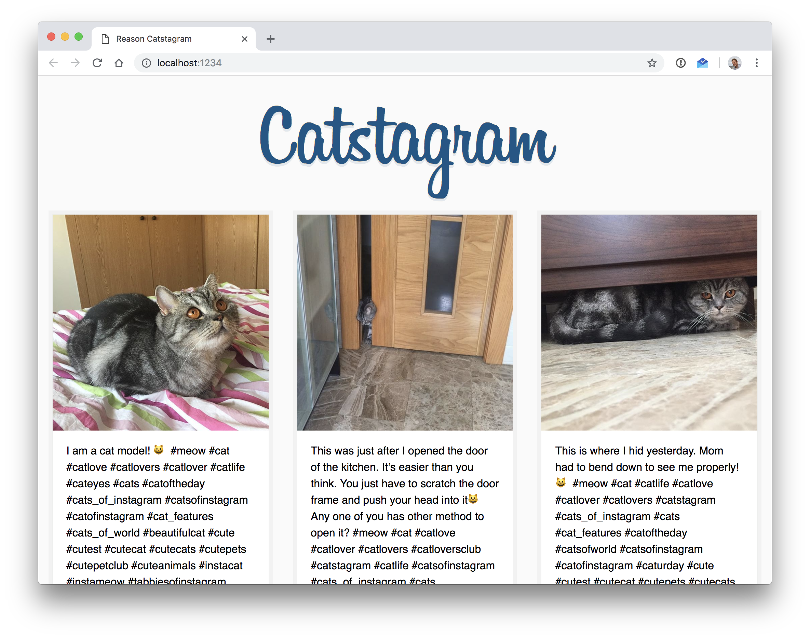

# reason-catstagram

My very first ReasonReact app, of course, about cats! 🐈



## DevTools (vscode)

- Remove all prior reason plugins
- Install the official [**reason-vscode**](https://marketplace.visualstudio.com/items?itemName=jaredly.reason-vscode) extension!

## Install

```sh
$ npm i
```

## Development

```sh
$ npm start
```

## Usage

You need to get your own Instagram API_TOKEN and add a `.env` file:

```sh
# .env
API_TOKEN=xxxxxxxxxx.xxxxxxx.xxxxxxxxxxxxxxxxxxxxxxxxxxxxxxxx
```

### TODO

- [x] Add comments
- [x] Delete comments
- [x] Optimize calls to API
- [x] Fix # of comments
- [ ] Replace text with #`Hashtag`s
